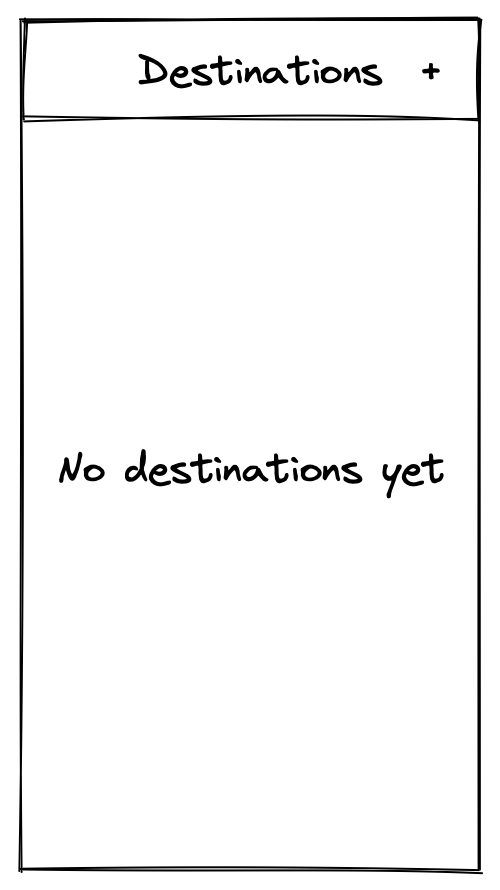

# Destinations

At Fluege.de, we want to write a new app for tracking how many
times a user has flown to a certain destination.

## Features

### Initial state

The app has a home screen containing a list of destinations. Initially,
it will be empty.

### Adding a destination

When the user taps on the “+” button, they will see a popover with a text
field. In it, they can input the name of the destination, and accept
or dismiss the input.

### Listing destinations

Once created, a new destination will appear in the home screen list.
By default, each destination has a stepper set to zero (which is the lower limit).

Tapping on a destination brings the user to a detail screen.

### Editing destinations

In the detail screen, the user can set the number of times they’ve flown to a
destination using a stepper.

The current value of the stepper is always reflected in the home screen.

### Changing a counter’s name

A user should be able to rename each counter’s title. A swipe gesture reveals
an edit button. Tapping on it will bring up the popover with the text field.

### Deleting counters

Users may want to delete counters, and we’ve got them covered. Each stepper
row can be deleted by a swipe gesture, as shown above.

